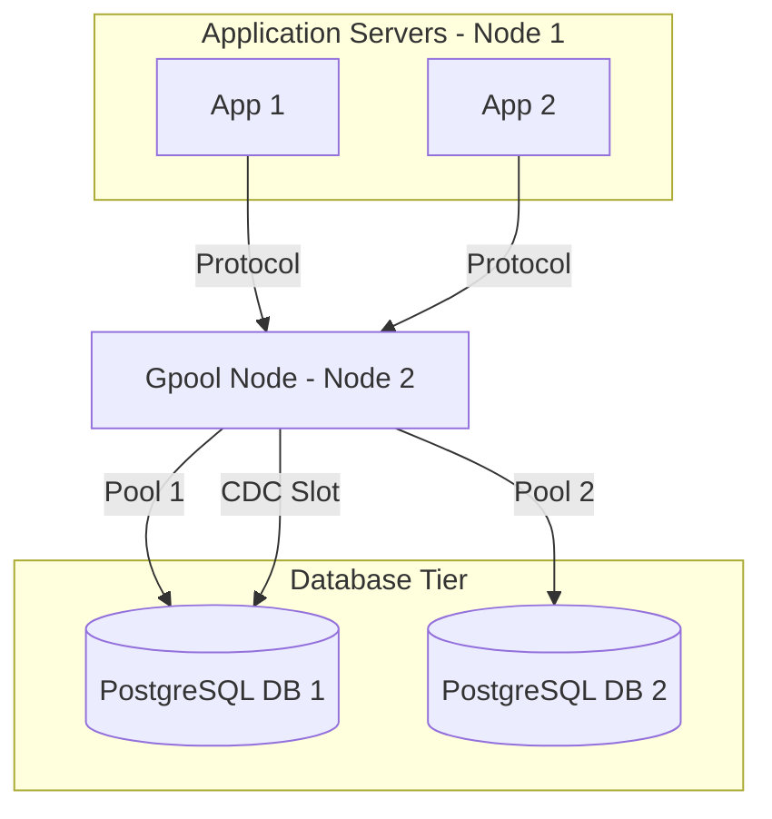
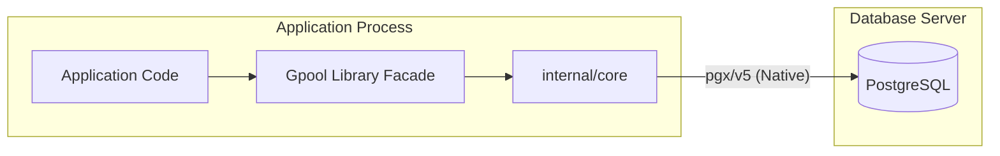

# Requirements

### Overview & Goals
Create `Gpool`, a high-performance, Go 1.26-native connection pooling solution for PostgreSQL. It aims to replace infrastructure-level poolers like **PgBouncer** by providing both an application-level (library) and a standalone CLI (proxy) high-performance connection pooler that also integrates real-time Change Data Capture (CDC). The architecture is designed to be **vendor-agnostic**, supporting multiple backend databases within a single Gpool instance while maintaining a unified, developer-friendly interface.

### Scope
- **In Scope**:
    - High-performance connection pooling for PostgreSQL using `pgx/v5`.
    - **Multi-Database Support**: Ability for a single Gpool instance to manage connections to multiple independent backend databases.
    - **PgBouncer Replacement**: 
        - **Library Mode**: In-process transaction pooling to eliminate sidecar overhead.
        - **CLI Proxy Mode**: Standalone executable mimicking the PostgreSQL wire protocol for external clients.
    - **Multi-Vendor Architecture**: Design for extensibility to MySQL, Oracle, etc.
    - Integrated CDC support via Logical Replication.
    - Go 1.26 iterator support for query results and CDC streams.
    - Zero-allocation message parsing for CDC events.
- **Out of Scope**:
    - Support for non-PostgreSQL vendors in the initial release (architecture only).
    - Complex ORM features (focus is on pooling and streaming).
    - Built-in Kafka/Elasticsearch exporters (event consumption is via user-defined handlers).

### Functional Requirements
- **Standard Queries**: Provide a thread-safe pool for executing SQL with minimal overhead.
- **CLI Proxy Mode**: Standalone application that mimics the PostgreSQL wire protocol (v3) to allow standard clients (`psql`, other apps) to connect directly to Gpool. Optimized for distributed deployments where Gpool runs on a dedicated server (**Node 2**) serving multiple application servers (**Node 1**).
- **Multi-Database Routing**: The proxy server must be able to route incoming connections to the correct backend pool based on the `database` parameter provided in the PostgreSQL `StartupMessage`.
- **Network Security**: Support for TLS/SSL termination to secure communication between Application (Node 1) and Gpool (Node 2).
- **YAML Configuration**: The CLI application must support loading configuration from YAML files for networking, security, and pool settings.
- **Developer-Friendly Library API**: Provide a clean, intuitive API for integration into other Go applications, featuring simple constructors, sensible defaults, and clear interface boundaries.
- **CDC Streaming**: Allow users to subscribe to table changes (Insert/Update/Delete) via logical replication slots.
- **Modern API**: Leverage Go 1.26 features like `iter.Seq` for streaming results (in library mode).
- **State Management**: Automatic handling of replication slots and publications.

### Non-Functional Requirements
- **Performance**: Sub-microsecond acquisition time; minimal allocations in hot paths.
- **High-Concurrency Throughput**: Optimized for thousands of concurrent connections with minimal tail latency (p99).
- **Thread-Safety**: Fully thread-safe implementation following Go concurrency patterns (atomics, sharded locks).
- **Reliability**: Robust error handling for network partitions and replication lag.
- **Security**: Mandatory use of prepared statements and parameterized queries.
- **Observability**: Export pool statistics (conns, idle, wait time) compatible with Prometheus.

# Technical Design

### Current Landscape & Comparison
 Feature | `database/sql` | `pgxpool` | `PgBouncer` | `go-pq-cdc` | **Gpool (Proposed)** |
 :--- | :--- | :--- | :--- | :--- | :--- |
 **Performance** | Baseline | High (Native) | High (Networked) | N/A (CDC only) | **Ultra High (In-app/Proxy)** |
 **CDC Support** | None | Low-level (Manual) | None | High | **High (Integrated)** |
 **Go 1.26 Syntax** | Limited | Partial | N/A | No | **Full (Iterators)** |
 **Infrastructure** | Simple | Simple | **Complex (Sidecar)** | Simple | **Flexible (Lib/CLI)** |
 **Transaction Mode**| Partial | Needs Config | **Yes** | N/A | **Native Support** |

### Key Decisions
- **Programming by Interface**: Define core behaviors (`Pool`, `Subscriber`, `Conn`) as interfaces in `pkg/gpool`. Implementations are vendor-specific and reside in `internal/vendors`.
- **Vendor Abstraction (Factory Pattern)**: Use a `VendorFactory` to instantiate specific implementations based on the provided configuration (e.g., `postgres`). This ensures the core logic remains decoupled from vendor-specific drivers.
- **Multi-Database Engine**: Extend `gpool.Engine` to manage a registry of `Pool` instances keyed by database name.
- **Dynamic Proxy Routing**: The `proxy.Server` inspects the `StartupMessage` for the `database` key and dynamically retrieves the corresponding pool from the engine.
- **Core Driver**: Use `pgx/v5` native interface for the PostgreSQL implementation.
- **Proxy Interface**: Use `pgproto3` for implementing the server-side PostgreSQL wire protocol in the CLI application.
- **Concurrency Strategy**: 
    - **Library Mode**: Use sharded mutexes or `sync.Map` to reduce lock contention in the connection pool.
    - **Proxy Mode**: Leverage Go's G-M-P scheduler for efficient goroutine management. Use a worker pool for complex packet processing.
- **Thread-Safety Implementation**: Use `sync/atomic` for connection counters and state flags; use `sync.RWMutex` for pool metadata to maximize read concurrency.
- **PgBouncer Parity**: Implement transaction-level pooling logic internally to allow removal of PgBouncer from the tech stack.
- **CDC Mechanism**: PostgreSQL Logical Replication (`pgoutput` plugin) for low-latency, zero-data-loss change tracking.
- **Configuration Management**: Use `gopkg.in/yaml.v3` for parsing standalone application configuration. The library will accept a typed `Config` struct.
- **Result Handling**: Implement `iter.Seq` for `Rows` to allow `for row := range pool.Query(...)` syntax.
- **Allocation Strategy**: Use `sync.Pool` for WAL message decoding and buffer management to achieve zero-allocation in hot paths.
- **Multi-Node CDC Strategy**: Use independent replication slots per Gpool node to ensure high availability and prevent data loss, rather than sharing slots or using advisory locks.

### Engine Performance: Gpool vs PgBouncer
Gpool is designed to be faster than PgBouncer by targeting the primary bottlenecks of sidecar pooling:

 Aspect | PgBouncer | Gpool (Lib Mode) | Gpool (Proxy Mode) | Why Gpool is Faster |
 :--- | :--- | :--- | :--- | :--- |
 **Latent Overhead** | ~0.1-0.5ms (IPC) | **<1µs** (Direct Call) | ~0.05ms (Go Proxy) | Eliminates Unix/TCP socket hops and context switches. |
 **Concurrency** | Event Loop (C) | **Go Scheduler (M:N)** | **Go Scheduler (M:N)** | Scales natively across all CPU cores without process tuning. |
 **Allocations** | C Buffer Pool | **sync.Pool** | **sync.Pool** | Zero-copy WAL parsing and packet handling in Go. |
 **State Sync** | IPC Overhead | **Shared Memory** | **Shared Memory** | No serialization needed for pool status updates. |

### Architecture Diagram
#### Proxy Mode (Node 1 -> Node 2 -> DB)

#### Library Mode (In-process)

### Proposed Changes
- **Directory Structure**:
    - `pkg/gpool/`: Public interfaces (`Pool`, `Subscriber`, `Conn`, `Tx`). Designed for high discoverability.
    - `cmd/gpool/`: Entry point for the standalone CLI proxy application.
    - `internal/core/`: Common pooling logic, vendor-agnostic orchestration, and lifecycle management.
    - `internal/vendors/postgres/`:
        - `pool/`: PostgreSQL implementation of connection pooling.
        - `cdc/`: PostgreSQL logical replication and WAL parsing logic.
        - `proxy/`: PostgreSQL wire protocol listener and session handling.
    - `internal/config/`: Configuration models and YAML loading logic for the CLI application.
    - `internal/entities/`: Common data structures for events and metadata.
- **Patterns**:
    - **Facade Pattern**: `Gpool` struct to provide a simple entry point.
    - **Factory Pattern**: `VendorFactory` for creating vendor-specific instances.
    - **Strategy Pattern**: For different CDC protocol versions and pooling modes.
    - **Observer Pattern**: For CDC event distribution.
    - **Clean Code & SRP**: Each file contains one struct or one interface, adhering to the project's readability rules.

### Risks
- **Replication Slot Management**: Improper cleanup can lead to WAL bloating on the DB server. *Mitigation*: Implement robust lifecycle hooks and automatic slot monitoring.
- **Database Routing Latency**: Inspecting every startup packet might add negligible overhead. *Mitigation*: Use high-performance byte parsing for the `StartupMessage` parameters.
- **Transaction Mode Constraints**: Operating in transaction-level pooling mode limits session-level features (e.g., SET statements, prepared statements across transactions). *Mitigation*: Implement explicit state cleanup (DISCARD) and provide clear documentation on supported session features.

# Testing

### Validation Approach
Verification through high-concurrency stress tests and CDC event consistency checks.

### Key Scenarios
- **Pool Exhaustion**: Verify the library handles max connections and wait timeouts correctly under load.
- **Multi-Database Routing**: Connect to different databases through the same proxy port and verify each connection reaches the correct backend.
- **CLI Proxy Protocol Compliance**: Ensure `psql` and other standard drivers can connect from remote nodes (**Node 1**), authenticate, and execute queries through Gpool CLI (**Node 2**).
- **TLS Handshake**: Verify secure connection establishment between remote clients and the proxy.
- **CDC Event Ordering**: Ensure that inserts/updates/deletes are received in the exact order they occurred in the WAL.
- **Network Recovery**: Simulate DB restarts and verify the Subscriber resumes from the last confirmed LSN (Log Sequence Number).
- **PgBouncer Compatibility**: Run tests through a PgBouncer instance in transaction mode to ensure no state leakage.

### Test Changes
- **Unit Tests**: Mocks for `pgx` connections to test pool logic in isolation.
- **Integration Tests**: Docker-based PostgreSQL setup to test real logical replication.
- **Benchmarks**: Comparison benchmarks against `pgxpool` using `rtk go test -bench`.

# Delivery Steps

### ✓ Step 1: Research & Benchmarking Baseline
Research and define the benchmark suite to compare existing solutions (pgxpool, go-pq-cdc, and PgBouncer) against the proposed Gpool.
- Create a `benchmarks/` directory.
- Implement baseline benchmarks for `pgxpool`, `database/sql`, and `PgBouncer` (external process).
- **Concurrency Stress Test**: Define a high-concurrency benchmark (1k-10k goroutines) to measure lock contention.
- Define the CDC latency and throughput measurement metrics.

### ✓ Step 2: Core Interface & PostgreSQL Implementation
Implement the core interfaces and the PostgreSQL connection pooling logic, optimized for thread-safety and concurrency.
- Define the `Pool`, `Conn`, and `Tx` interfaces in `pkg/gpool`.
- Implement the `PostgresPool` in `internal/vendors/postgres/pool`.
- Implement **lock-sharded** connection acquisition and release logic.
- Use **atomics** for performance-critical state tracking.
- Integrate PgBouncer-friendly transaction handling (clean state management).
- Add support for Go 1.26 iterators in query result processing.

### ✓ Step 3: CDC Engine & PostgreSQL Implementation
Implement the Change Data Capture (CDC) engine using PostgreSQL logical replication.
- Define the `Subscriber` interface in `pkg/gpool`.
- Implement the `PostgresSubscriber` in `internal/vendors/postgres/cdc`.
- Handle publication and replication slot management.
- Create a component that handles WAL streaming using `pglogrepl`.
- Provide an iterator-based API for consuming CDC events.
- Implement zero-allocation message parsing using `sync.Pool`.

### ✗ Step 4: PostgreSQL Wire Proxy & CLI Implementation — REMOVED
**Superseded. Gpool is a library only; the proxy, the CLI, and the YAML config were deleted.**

The delivered code was also non-functional: `pgproto3.Backend.Send` only buffers, and `Flush`
was never called, so no byte ever reached a client. It additionally had no authentication
("accept all"), no `ParameterStatus`/`BackendKeyData` before `ReadyForQuery`, `context.Background()`
on every query, and an accept loop that spun at 100% CPU on a closed listener.

If proxy mode is ever wanted again it should be a **separate module** depending on this one, so
the library keeps its zero-binary, zero-config surface.

~~- Implement the wire protocol listener in `internal/vendors/postgres/proxy` using `pgproto3`.~~
~~- Implement Network Configuration: interface binding, port configuration, TLS certificates.~~
~~- Implement YAML configuration loading and validation in `internal/config`.~~
~~- Handle startup packets, authentication (passthrough/MD5/SCRAM), and query execution routing.~~
~~- Implement CLI commands in `cmd/gpool`.~~

### ✓ Step 5: Unified API & Demo Integration
Expose the unified library API and provide a demo implementation for both library and CLI modes.
- Finalize the `Gpool` facade in `pkg/gpool` that orchestrates both Pool and Subscriber.
- Create a demo application in `cmd/gpool-demo` to showcase library usage, CLI proxy usage, and real-time CDC.
- Ensure full compliance with project guidelines (OOP, Clean Code, Security).
- **Observability**: Export pool statistics (conns, idle, wait time) compatible with Prometheus.

### ✓ Step 6: Dynamic CDC Table Management
Implement support for adding and removing tables from a running CDC subscription.
- Add `AddTables` and `RemoveTables` to the `Subscriber` interface.
- Implement `ALTER PUBLICATION` logic in the PostgreSQL vendor.
- Update documentation and demo to showcase dynamic table management.

### ✓ Step 7: CDC Tracking Verification
Implement functionality to verify if specific tables are being tracked by the CDC engine.
- Add `IsTracking` and `GetTables` to the `Subscriber` interface.
- Implement `IsTracking` (local) and `VerifyTable` (database-backed) in the PostgreSQL vendor.
- Update documentation and demo to showcase tracking verification.

### ✓ Step 8: Dynamic CDC Reconciliation
Ensure the CDC engine can reconcile the tracking list between local config and the database.
- Add `SyncTables` to the `Subscriber` interface.
- Implement `SyncTables` using `ALTER PUBLICATION ... SET TABLE`.
- Refine `Subscribe` and dynamic management to ensure consistency.
- Update documentation and demo.

### ✓ Step 9: Advanced CDC Management
Implement functionality to manage replication slots, publications, and multiple subscribers.
- Add `CreateSlot`, `DropSlot`, `CreatePublication`, `DropPublication` to the `Subscriber` interface.
- Implement these methods in the PostgreSQL vendor.
- Refactor `Engine` to support multiple named subscribers.
- Update documentation and demo.

### ✓ Step 10: Multi-Database Support
Extend Gpool to support multiple backend databases in a single instance. Delivered as a library
feature: one pool per database, registered by name on the `Engine`, with nothing shared between
them so one database saturating or failing cannot starve another.
- ~~Update `config.Config` to allow defining multiple database pools in YAML.~~ *(No config file — the caller constructs each pool.)*
- Modify `gpool.Engine` to manage a map of `Pool` instances.
- ~~Implement database routing in `proxy.Server` by parsing the `StartupMessage`.~~ *(Proxy removed in Step 4.)*
- Add pool selection to `Engine`: `Pool(name...)`, `AddPool`, `RemovePool`, `Pools`.
  *(Named `Pool(name)` rather than `GetPool(name)` to match `Subscriber(name)` and avoid a `Get` prefix.)*
- Document multi-database usage in `README.md`.
- Integration tests covering routing, data isolation, saturation containment, concurrent
  cross-database load, and `Engine.Close` closing every pool.

### ✓ Step 11: Production Hardening
Audit and fix the correctness, concurrency, and resource defects in Steps 2-9, then establish the
test suite that should have caught them.
- Fixed 40 findings across panics/object-pool aliasing, data races, resource leaks, data loss,
  and bottlenecks. See `mem:invariants` for the durable rules that came out of it.
- Split the CDC control connection from the replication connection: table management on a
  walsender connection in CopyBoth mode corrupts the protocol.
- Resume replication from the slot's `confirmed_flush_lsn`; confirm positions only after the
  consumer has processed the event; advance the position from idle keepalives so a quiet
  publication cannot pin WAL until the primary's disk fills.
- Stopped recycling any object whose lifetime user code controls, making every teardown idempotent.
- Added unit, integration, and benchmark suites; two further defects were found by those and not
  by inspection.

### ✓ Step 12: Scale and Footprint
Reduce memory and CPU under the concurrency a pooler actually sees, driven by profiles rather
than assumption.
- Replaced the counting semaphore with a token channel: the acquire path lost its global mutex
  convoy and all of its allocations (~1134 → ~599 ns/op, 4 → 1 allocs/op at 5000 callers).
- Bounded the per-connection statement and description caches, which pgx preallocates at 512 and
  which were 57% of the pool's heap (~71 → ~28 KiB per connection).
- Dropped `golang.org/x/sync`; the only dependencies left are `pgx/v5` and `pglogrepl`.
- Added scale benchmarks, a per-connection memory measurement, and a goroutine-cost test.